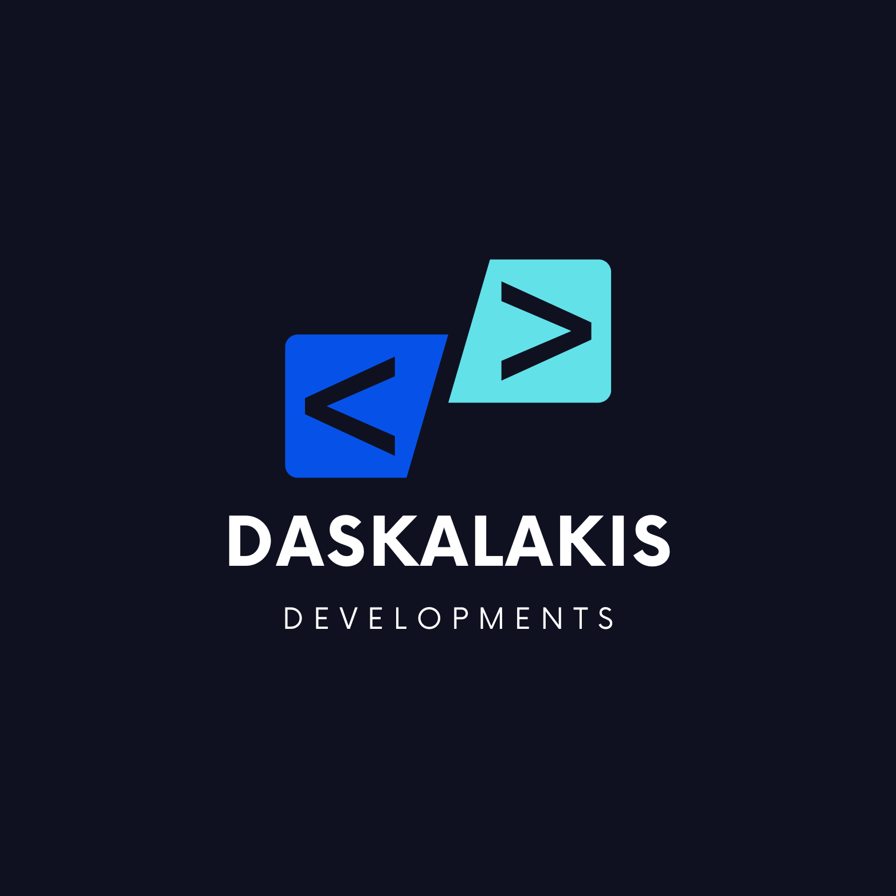

<!-- PROJECT LOGO -->
<br />
<div align="center">
  <a href="https://github.com/github_username/repo_name">
    
  </a>

<h3 align="center">Nextjs Dark Theme</h3>

  <p align="center">
   Creating a NextJS Dark/Light/System theme with ShadcnUI
    <br />
    <a href="/"><strong>The doc below</strong></a>
    <br />
    <br />
    <a href="https://incredible-cocada-ed90e1.netlify.app/">View Demo</a>
    &middot;
    <!-- <a href="https://github.com/github_username/repo_name/issues/new?labels=bug&template=bug-report---.md">Report Bug</a>
    &middot; -->
    <a href="https://daskalakisdev.com/request">Request Feature</a>
  </p>
</div>


<!-- GETTING STARTED -->
## Getting Started

This is an example of how you may give instructions on setting up your project locally.
To get a local copy up and running follow these simple example steps.

### Prerequisites

This is an example of how to list things you need to use the software and how to install them.
* npm
  ```sh
  npm install npm@latest -g
  ```

### Installation

<!-- 1. Get a free API Key at [https://example.com](https://example.com)
 -->
1. Let's Start
2. Clone the repo
   ```sh
   git clone https://github.com/daskalakisdevelopments/nextjs-dark-theme.git
   ```
3. Install NPM packages
   ```sh
   npm install
   ```
<!-- 4. Enter your API in `config.js`
   ```js
   const API_KEY = 'ENTER YOUR API';
   ```
5. Change git remote url to avoid accidental pushes to base project
   ```sh
   git remote set-url origin github_username/repo_name
   git remote -v # confirm the changes
   ``` -->
## Contributing

## 📦 Installation

```bash
# Clone the repository
git clone https://github.com/daskalakisdevelopments/nextjs-dark-theme.git

# Navigate to the project directory
cd your-repo

# npm install
npm install

# Create a folder named navigation/navbar
# Inside /navbar add two files
index.tsx , theme.tsx

Install $ npx shadcn@latest init
Install $ npx shadcn@latest add dropdown-menu
Install $ npx shadcn@latest add button
Install $ npm install next-themes

# on layout of your app wrap the children and all your components with

<ThemeProvider 
   attribute='class' 
   defaultTheme="system"
   enableSystem 
   disableTransitionOnChange
>
  <Navbar />
  {children}
</ThemeProvider>
<p align="right">(<a href="#readme-top">back to top</a>)</p>
